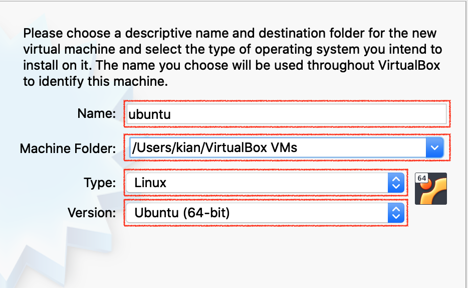
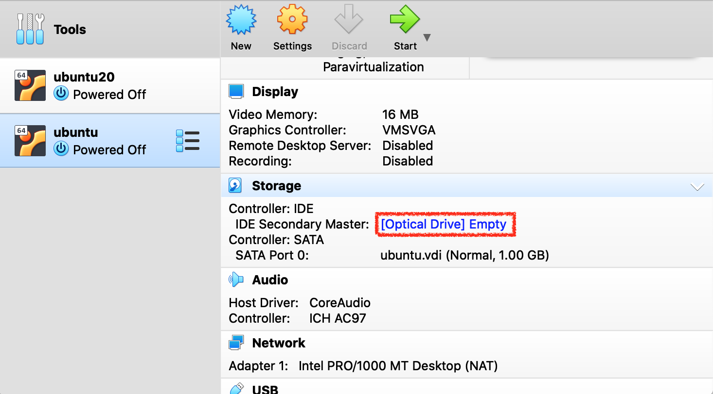
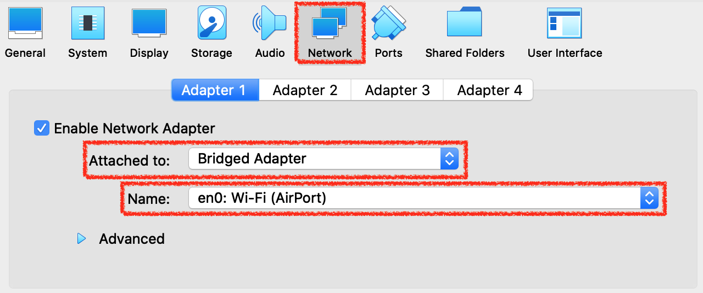
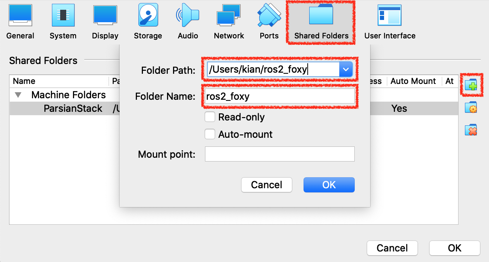

# BSc Thesis - Formation Control of Multi-robot Systems
Implementation and formation control of playmaker and supporter robots in small size soccer league in the context of the Internet of Things

## grSim
The project is based on grSim simulator that was contributed to the SSL community. It performs a physical simulation of omni-directional robots and publishes envoironment network packages.
You can either found it from this [github link](https://github.com/RoboCup-SSL/grSim) or you can have it by updating your git submodules with cloning this repository.
```bash
git clone --recurse-submodules https://github.com/kianbehzad/BScThesis.git
```
Then go according to the [installation file](https://github.com/RoboCup-SSL/grSim/blob/master/INSTALL.md) to install it.
**note.** if you wish to install grSim on Windows OS you should use docker. you can use a prebuilt image from [this Docker Hub](https://hub.docker.com/r/bermeom/grsim) container.

## ROS2
To use this project you will need to install ROS2 (this project is developed and tested on Foxy Fitzroy). You can refer to [ROS2 installation page](https://index.ros.org/doc/ros2/Installation/) in order to install whatever versions you wish.

## Installation
This project is based on ROS2 and it can be run on any Operating Systems with ROS2 installed on it. (this project is developed and tested on Ubuntu 20.04)

### Linux
ROS2 supports different Linux distributions, any one of them is fine to work with.
After installing ROS2, you need to install google protocol buffer. (if you installed grSim, it is already installed)
```bash
sudo apt install libprotobuf-dev protobuf-compiler
```
Now we just need to install colcon to build our project.
```bash
sudo apt install python3-colcon-common-extensions
```
Go to the project's ROS2 directory and build the entire workspace. (It may take a few minutes for the first time)
```bash
cd /path/to/cloned/project/
cd thesis_ws/
colcon build
```
After a successfull build, source the `setup.zsh` file as usual by adding the following line to `~/.zshrc`
```bash
source /path/to/thesis_ws/install/setup.zsh
```
Now, you can launch the project.
```bash
ros2 launch src/pack_util/tools/launch/grsim_launch.py
```

### MacOS and Windows
ROS2 only supports Windows10, macOS Sierra (10.12.x), and macOS Mojave (10.14) at this time. Also the installation is not as stable as Linux. All in all, you can successfully run the project on these platforms but using a virtual machine like Oracle VM VirtualBox is recommended if you insist on using these Operating Systems.

### Oracle VM VirtualBox
You can download your suitable version of Oracle VM from [this link](https://www.oracle.com/virtualization/technologies/vm/downloads/virtualbox-downloads.html).
Then you need to download an Ubuntu 20.04 Desktop ISO file from the [official page](https://ubuntu.com/download/desktop).
- Now, Start the VirtualBox application and create a new VM.
<p align="center">

</p>

- Then name your VM, specify a path for it, and choose Linux 64 bit as it's type.
<p align="center">

</p>

- Choose the **memory size** you wish the VM has.

- Then, choose **Create a virtual hard disk now** and select create.

- After that, choose **VDI (VirtualBox Disk Image)** and select continue.

- It is better to use **Fixed size** storage type.

- Specify your desired **disk size** and **it's path** afterward.

- Now after your VM created, click your VM from the left bar and right click on **Controller:IDE** section from right menu.
<p align="center">

</p>

- Choose the Ubuntu 20.04 ISO file you have downloaded.
- Click on start, to start your VM and Install Ubuntu 20.04 on it.
- After the installation you can follow the steps for **Linux** Installation above.

#### Optional - Oracle VM VirtualBox
- **Running ROS2 nodes on multiple machines**\
if you intent to distribute your nodes on different hosts across your local network, you need to change your VM's network preferences.
	- Shutdown your VM, select your VM from VirtualBox application, and click on settings on top of the window.
	- Choose the **Network** tab from the top, and change the **NAT** setting to **Bridged Adapter**.
	- Then choose one of your host's network interfaces from the second dropdown menu.
	- Now your router will assign a seperate IP address to your VM, you can check it out by `ifconfig` command.
		 ```bash
		sudo apt install net-tools
		ifconfig
		```
<p align="center">

</p>

- **Define a shared folder between host and VM** (adopted from [here](https://gist.github.com/estorgio/1d679f962e8209f8a9232f7593683265))\
To define a shared folder between your host and VM, first you need to have it on your host and then mount it on the VM.
	- Say we want to mount `/Users/<username>/ros2_foxy` from the host to `/home/<username>/ros2_foxy` on your VM.
	- Shutdown your VM, select your VM from VirtualBox application, and click on settings on top of the window.
	- Choose the **Shared Folders** tab from the top, and click on the **Add new shared folder** icon. (picture at the end of the section)
	- Choose the folder on your host, and put it's name in the second field and leave everything else unchecked. (picture at the end of the section)
	- Run your VM, and run the commands bellow.
		```
		sudo apt-get update
		sudo apt-get install build-essential linux-headers-`uname -r`
		```
	- from the top of your VM, go to **Devices** menu -> **Insert Guest Additions CD image menu**, and let the process finishes.
	- reboot your VM.
		```
		sudo shutdown -r now
		```
	- Edit the `/etc/fstab` file and add the following line at the end. you can use `id -u` command to get your username ID(uid) - this option is needed to change the ownership of the mounted folder too your user (default is for root user)
		 ```bash
		<the name in the above field>	/home/<username>/ros2_foxy	vboxsf	uid=1000	0	0
		```
	- Edit the `/etc/modules` file and add the `vboxsf` at the end of it.
	- Now reboot your VM again and the folder should be mounted in your home directory.
<p align="center">

</p>

- **Use CLion to remotely program on your VM**\
You can configure host's CLion in a way to use your VM's toolchain, to be able to program and run your software remotely from your host machine.
	- First you need to setup SSH on your VM. (adopted from [here](https://dev.to/shafikshaon/ubuntu-server-setup-on-virtual-box-and-connect-with-ssh-56k0)) 
		- install the following packages.
			```
			sudo apt update
			sudo apt install openssh-server
			sudo apt install ssh
			```
		- Verify SSH is running. (you should see `Active: active (running)` in the output)
			```
			sudo systemctl status ssh
			```
		- Disable the firewall
			```
			sudo ufw disable
			```
		- now you can SSH to your VM with it's username and IP (`ifconfig`)

	- Second, follow the instruction from the [CLion webpage](https://www.jetbrains.com/help/clion/remote-projects-support.html#remote-toolchain) to set the toolchain of your IDE from VM and do your work from your host.
	- **important note** if you want to edit a ROS2 package in your remote IDE (which probably you are) you should define all the necessary `environment variables` in CLion settings. But an easier solution is to  create `~/.zshenv` file in VM's home directory and source both ROS2's and workspace's `setup.zsh` in this file instead of in `~/.zshrc`. It is not the correct place to source our setup files but the `~/.zshenv` file automatically runs with every login (including SSH from CLion) so the needed `environment variables` will be defined for CLion automatically.
